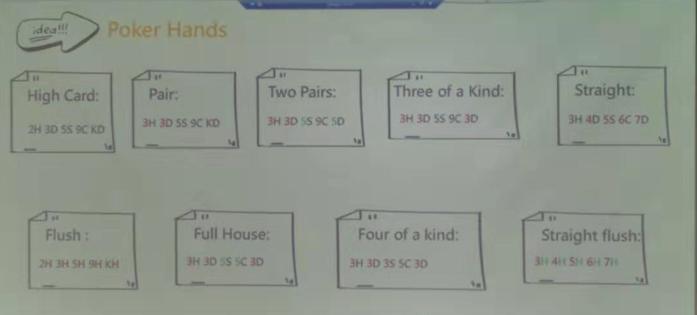

# porker_game
A porker game developed by TDD

# tasking

### Introduction:



* these test cases wrote by level 0-8 as the picture above, here are the levels' mean:
  * level 0: normal card, every one is single with normal suit;
  * level 1: 2 cards' number are same (that mean a pair) in 5 cards with normal suit;
  * level 2: 2 pairs in 5 cards with normal suit;
  * level 3: 3 cards' number are same in 5 cards with normal suit;
  * level 4: 5 cards' number are on a sequence with normal suit;
  * level 5: 5 cards' suit are same with normal number;
  * level 6: 3 cards' number are same, the other 2 cards are same as well in 5 cards with normal suit;
  * level 7: 4 cards' number are same in 5 cards with normal suit;
  * level8: 5 cards' number are on a sequence with same suit at the same time in 5 cards.
* Test cases below wrote by rule: 
  * left is given(use "**,**" to easy for identify player1 and player2), => right is result
  * if the suit should be normal, then I **won't** write below for easy focusing on the core difference, but it exists really in test case.

### My Test Cases(or tasking):

###### compare single card:

1. 2, 3 => 2
2. 2, 2 => 0

###### level 0 vs level 0:

```java
//supplement one test case 3.1: 2 3 4 5 9, 2 3 4 5 8 => 1
```

3. 2 3 4 T A, 2 3 J Q K => 1

###### level 0 vs level 1:

4. 2 3 4 5 7, 2 2 4 5 6 => 2

###### level 1 vs level 1:

5. 2 2 4 5 7, 3 3 4 5 6 => 2

6. 2 2 4 5 7, 2 2 4 5 6 => 1

###### level 1 vs level 2:

7. 4 4 5 6 7, 2 2 3 3 4 => 2

###### level 2 vs level 2:

8. 2 2 4 4 6, 2 2 3 3 7 => 1

9. 2 2 3 3 4, 2 2 3 3 5 => 2

###### level 2 vs level 3:

10. 4 4 5 5 6, 2 2 2 3 4 => 2

###### level 3 vs level 3:

11. 4 4 4 5 6, 2 2 2 3 4 => 1

###### level 3 vs level 4:

12. 4 4 4 5 6, 2 3 4 5 6 => 2

###### level 4 vs level 4:

13. 2 3 4 5 6, 3 4 5 6 7 => 2

###### level 4 vs level 5:

14. 5 6 7 8 9, 2H 3H 5H 6H 8H => 2

###### level 5 vs level 5:

15. 2H 3H 5H 6H 9H, 2D 3D 5D 6D 8D => 1

###### level 5 vs level 6:

16. 2H 3H 5H 6H 9H, 4 4 4 7 7 => 2

###### level 6 vs level 6:

17. 5 5 5 2 2, 3 3 3 7 7 => 1

###### level 6 vs level 7:

18. 5 5 5 6 6, 4 4 4 4 3 => 2

###### level 7 vs level 7:

19. 5 5 5 5 2, 4 4 4 4 7 => 1

###### level 7 vs level 8:

20. 9 9 9 9 T, 2H 3H 4H 5H 6H => 2

###### level 8 vs level 8:

21. 3H 4H 5H 6H 7H, 2D 3D 4D 5D 6D => 1

###### bounds rule:

22. 2 3 4 5 F, 3 4 5 6 9 => throw Exception: Invalid point!
23. 2 3 4 6 7, 2 4 5 6 8X => throw Exception: Invalid suit!
24. 2 3 4 6 7 8, 2 3 4 5 9 => throw Exception: The total number of cards is over!
25. 2 2 2 4 5, 2 2 2 3 6 => throw Exception: Every point has 4 cards at most!